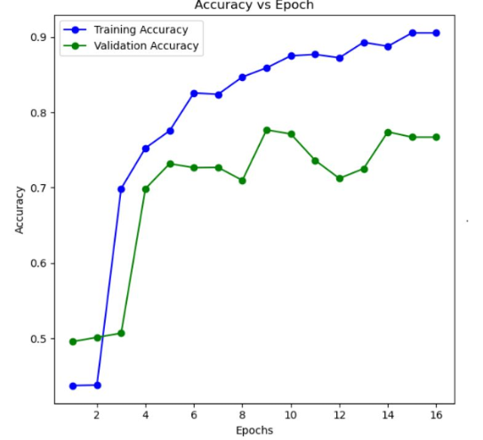
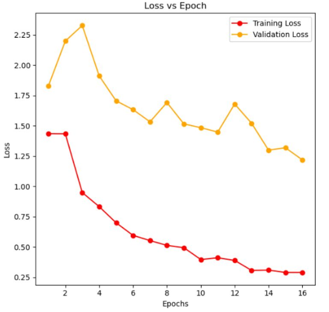
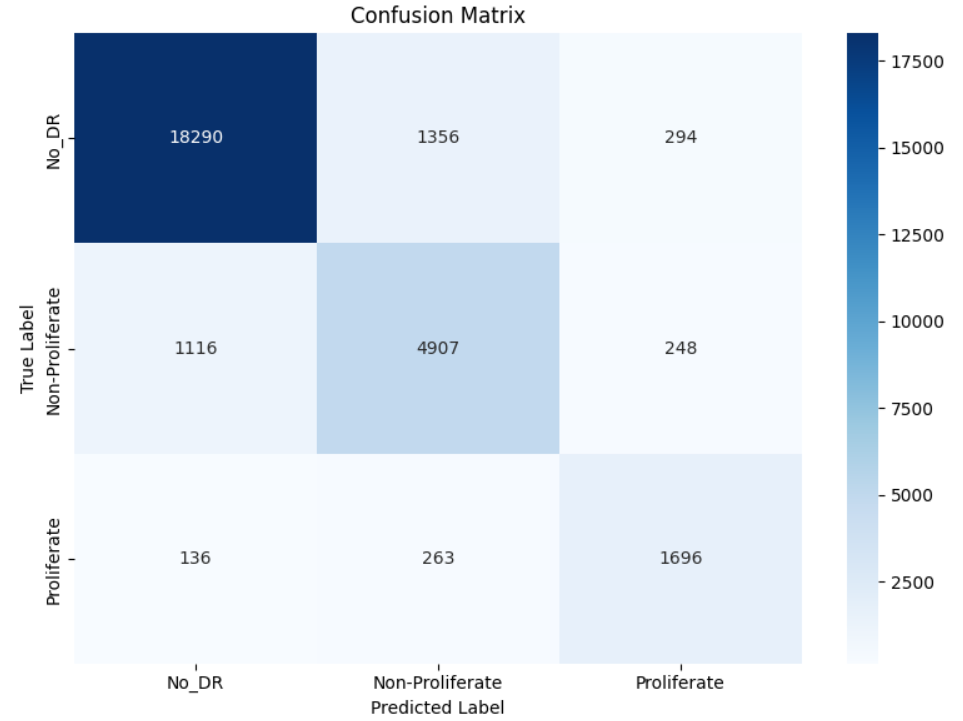

# Diabetic_Retinopathy_Detection
# AI-Driven Analysis of Retinal Images for Early Detection of Diabetic Retinopathy

## Overview
This repository contains code, and model for a deep learning-based retinal image analysis pipeline designed to automatically detect and classify Diabetic Retinopathy (DR) severity from fundus images. 

## Key Features
- High-accuracy DR stage classification using EfficientNet-B3
- Preprocessing: green-channel extraction, CLAHE, median filtering, and contrast stretching
- Class-balanced training and augmentation
- Five-class labeling: No DR, Mild, Moderate, Severe, Proliferative
- Compatible with real-world datasets such as APTOS 2019

## Accuracies
- **Model1** (EfficientNet-B3 variant): 81.6% on the test set
- **Model2** (Fine-tuned or enhanced variant): 78.9% on the test set

## Table of Contents
- [Introduction](#introduction)
- [Diabetic Retinopathy Classes](#diabetic-retinopathy-classes)
- [Datasets](#datasets)
- [Preprocessing Pipeline](#preprocessing-pipeline)
- [Data Augmentation](#data-augmentation)
- [Model Architecture](#model-architecture)
- [Training Strategy](#training-strategy)
- [Evaluation](#evaluation)

## Introduction
Diabetic Retinopathy (DR) is a leading cause of vision loss in working-age adults. Early detection and classification are crucial for timely intervention. This project leverages deep learning (EfficientNet-B3 backbone) to automate the grading of DR severity, supporting clinicians and large-scale health programs.

## Diabetic Retinopathy Classes
- **No DR:** Normal retina, no microaneurysms or lesions.
- **Mild NPDR:** Few microaneurysms, no hemorrhages or exudates.
- **Moderate NPDR:** More microaneurysms, dot/blot hemorrhages, some exudates, and cotton-wool spots.
- **Severe NPDR:** Extensive hemorrhages (>2 quadrants), pronounced venous beading, IRMA, high progression risk.
- **Proliferative DR:** Neovascularization, risk of vitreous hemorrhage/detachment, requires urgent specialist intervention.

## Datasets
- **Training:** ‘Diabetic Retinopathy Arranged dataset’ [Kaggle](https://www.kaggle.com/datasets/amanneo/diabetic-retinopathy-resized-arranged/data)
- **Testing:** APTOS 2019 Blindness Detection dataset [Kaggle](https://www.kaggle.com/competitions/aptos2019-blindness-detection/data)
- Both have five-class labels; test distributions may differ due to collection conditions.

## Preprocessing Pipeline
- Image loading with error handling
- Green-channel extraction (emphasizes vessels)
- Contrast enhancement using CLAHE
- Median filtering (noise reduction)
- Contrast stretching (focuses on mid-range intensities)
- Resize to 300 × 300 px
- Normalize pixel values

## Data Augmentation
- Horizontal (p=0.5) and vertical (p=0.3) flips
- Random rotations (±25°) and scaling (0.9–1.1x)
- Random brightness and contrast adjustments
- Batch-wise re-normalization

## Model Architecture
- **Backbone:** EfficientNet-B3 (ImageNet-pretrained)
- **Custom Head:** Global Average Pooling, Dropout(0.5), Dense(5), Softmax
- Early layers frozen for initial epochs
- Loss: Class-weighted categorical cross-entropy
- Optimizer: Adam with ReduceLROnPlateau

## Training Strategy
- Up to 20 epochs with early stopping (patience=6)
- Batch size: 16
- Real-time augmentations and class balancing

## Accuracy-Loss while training and validation

## Evaluation
- **Model 1** [Link](https://drive.google.com/file/d/1x-N6d0C4FbB62wBtOY9PVINpiWtEWhMc/view?usp=sharing)
- Test Accuracy: 81.6%
- **Model 2** [Link](https://drive.google.com/file/d/1AfKK8Ohn-X4wJc1SkIz5kTwuosQ7V-z_/view?usp=sharing)
- Test Accuracy: 78.9%
- Strongest performance on “No_DR”; common misclassifications between adjacent severity levels
- Confusion matrix and more metrics provided in the report

## Confusion matrix for model 1

